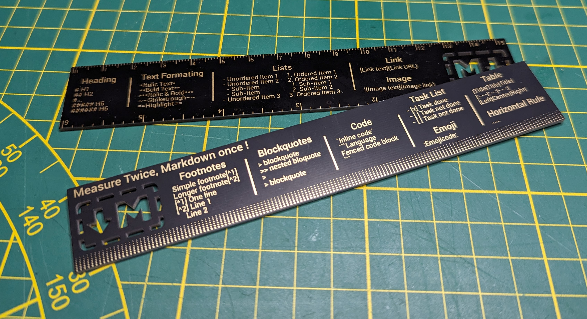

# Markdown Ruler Cheat Sheet
 A ruler design to help users use the Markdown markup language.

Use all the information come from the [Markdown Cheat Sheet](https://www.markdownguide.org/cheat-sheet/) made available by the [Markdown Guide](https://www.markdownguide.org/).

**Markdown Ruler picture**

**3D Rendering Top & Bottom**

---
## Why ?
- Physical object is always cool
- PCB is a great material to be custom and precise
- A ruler is always useful for many things like measuring !
- Easily convert measurements in cm to inch
- Measure up to 15cm or 6 inchs

---
## What is Markdown
Markdown is a lightweight markup language that uses simple syntax to format text. It is designed to be easy to read and write, and can be converted into HTML, PDF, and other formats. With Markdown, you can easily create headings, lists, bold and italic text, links, images, and more. Its simplicity and flexibility make it popular for creating content for the web, such as blog posts, documentation, and README files.

---
## Information on the ruler
- **Heading** : H1 to H6
- **Text Formating** : Italic / Bold /Italic & Bold / Striketrough / Highlight
- **List**
  - Unordered with sub-item
  - Ordered with sub-item
- **Link**
- **Image**
- **Footnotes** : Simple and longer footnote
- **Blockquotes** : Simple and nested blockquote
- **Code** : Inline code and fenced code block
- **Task List** : Task done and task not done
- **Table** : Left / Center / Right alignment
- **Horizontal Rule**
- **Emoji**

---
## GitHub Files
- **EasyEDA Design File** : Open this file with EasyEDA and start modify the design to your own taste
- **GERBER files** : This file is use to make the PCB, just drag and drop this file to your favorite PCB manufacturer (JLCPCB, PCBWay, OSHPARK...)
  - **BoardOutlineLayer** : PCB cutout area
  - **BottomLayer** : Copper area on the bottom of the PCB
  - **TopLayer** : Copper area on the top of the PCB
  - **BottomSolderMaskLayer** : Area without solder mask on the bottom of the PCB
  - **TopSolderMaskLayer** : Area without solder mask on the top of the PCB
- **Pictures** : See the picture and the two 3D rendering in enlarged size 

---
## PCB characteristic
- Size 155 x 25mm
- Black PCB
- 1.6mm Thickness
- ENIG surface Finish
- MarkDown Logo cutout

---
## Process design
1. Draw all the design using [Fusion360](https://www.autodesk.fr/products/fusion-360/personal)
2. Export each sketch to .svg using the [Shaper Tools plugin](https://support.shapertools.com/hc/en-us/articles/115002735814-Exporting-SVGs-from-Fusion)
3. Fill all the area using [Inkscape](https://inkscape.org/fr/)
4. Import the new .svg to EasyEDA using the [easyeda-svg-import plugin](https://github.com/xsrf/easyeda-svg-import)

---
## Inspiration
|Project|Picture|
|:--|:--:|
|Adafruit PCB Ruler||
|ANCHOCO Card||
|Digirule2 Binary Ruler|/i/94921/products/2018-10-26T06%3A40%3A25.922Z-Digirule2%20Cover.jpg?1606306133)|
|Bolt Industries PCB Ruler||
|CheatKard Cheat Sheets for Electronics||